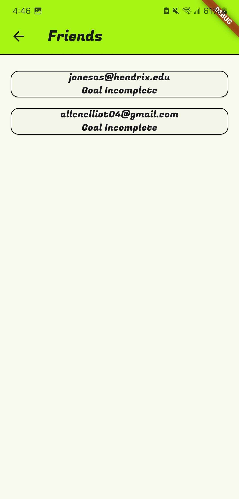
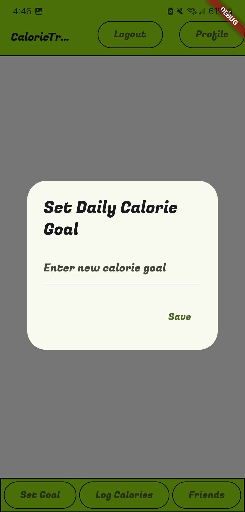

# calorie-tracker-plus-plus

# Who is the audience for this app
# The audience is intended for anyone who tracks their calories, which can be burned or consumed.

# What the app does
# The app helps the user create a goal and follow through by subtracting the calories consumed and adding the calories burned to the goal for that day.

# Why the app is useful
# The app is useful because it could help people gain or lose weight and simply monitor their exercise or eating habits and how that contributes to their health.

# Multiple Screenshots of your app
     
  

# Also, be sure to include an appropriate LICENSE for your application
